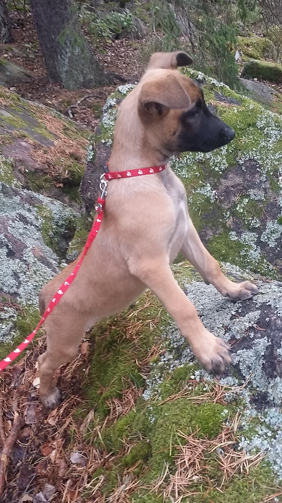

## Week 10 (9 weeks old malinois puppy)

When we first seen alice at the kennel she was around 7 weeks old. We had originally been considering german shepherd since german shepherds are fantastic dogs and a breed I'm quite familiar with, but after researching the malinois breed it sounded just like the right kind of dog. I mean how can anyone not want a Malinois after watching these videos:

https://www.youtube.com/watch?v=gTpBFYuErzA
https://www.youtube.com/watch?v=8HLcFZNje_w

And this:
https://www.youtube.com/watch?v=TtLk8jExiiQ

Yes yes sure, a well trained dog with genetics and training can do amazing things. But malinois has that a little bit extra. Maybe it is the adhd mentality of the dog, maybe it is the constant biting (as a form of play), the focus with which even a 9 weeks old puppy follows your hand with the ball or maybe something else. But the general temperament of the dog just feels perfect. The grown up belgian malinois are absolutely adorable.

# Initial socialization

I follow a few system rules with alice. 
1) she has to be exposed to a wide variety of experiences and do training in all situations
2) she has the right to say no to training after a prolonged session
3) every day mush include at least something that is related to her future work

I'll explain each section in detail below. 

# Variety of experience

Day 1 and day 2 were just getting used to the new home. It meant getting up every 2 hours in the night and take her out to the same place where she can hmm.. [go shit] :-). It's fine though, after a few days I even wake up before the alarm clock rings. I prefer getting out with her than cleaning up poop from the floor so that's motivating enough to get her out. And also it is very motivating to teach her to do it outside and IN THE WOODS so that this behavior can serve us later. 

One of the first really new experiences I did with Alice after we got her and after she got used to our home was to skip the car and take her out on the bus and the tube and among people into the city and into the office where I work. This was on day 3. It was a terrifying experience for her at first but I held her in my arms and did not allow her to make any decisions on her own besides deciding to sleep. She was just to hang along with me for the ride and get rewards after every scary experience. I usually reward her directly after the experience and have to try to keep myself from rewarding during the experience. Rewards have to come at the "end of the tunnel" not inside the tunnel. After all, I do not want her to think that crying is a good thing. 

So we get on the bus, she is a bit shaky and squeaks a bit. I hold her in my arms and we go with the bus. She is very scared on the first trip (on the way back she was totally fine with it and slept on the seat beside me - exposure pays off). Then we get off the bus and I put her down and praise her every way I can. Then we go to the tube. I try to let her walk with me into a new situation and only pick her up if she squeaks and refuses to go. So if pulling slightly on the leash does not work at all, I pick her up and we go together.

The tube is another completely new experience for her. She has no idea what all the sounds mean. She is scared but stays calm on my lap and sometimes hides her nose in my jacket. She is more relaxed. 

We get to the office building and everyone is all excited to clap her in the lobby she is very happy but then just lays down and sleeps on the floor by a wall. I pick her up and take her to the office. There I just place my jacket on the floor so she stays in one place and she sleeps in it for several hours until it is time to get up and go potty.. 

Near the office building there are woods (as mostly everywhere in sweden outside of inner city) so it is easy for me to take her to the woods when needed.

When we get back she gets to meet the first large dog that she did not grow up with: a really large labrador retreiver. Alice nips her in the nose with her teeth and generally goes full on defence/prey mode. I direct her attention at the ball instead and play with her while the other dog is near by. This does not give her the opportunity to get mad when the ball is bouncing in front of her consuming all of her attention. We did this for a while but she would still snap. If I had the whole day to get them used to eachother I would spend the day walking them outside on short leashes and getting them used to just walking close focusing on the walk and not lashing out at eachother. 

I also try to befriend the other dog and take the first initiative at getting close so Alice can see me by the other dog. This gives her the signal that I take care of it and she becomes perplexed by the conflicting emotions of wanting to get close to me yet also wanting to lash out at the other dog. I do not want to destroy her ability to defend her pack. That is a good quality. But it is also important that she does not lash out when not provoked and when her pack is not behind her. Since I want to be able to train Alice in defence it is really important that she does not get timid when I'm behind her. But when I'm in front of her and hugging the other dog I want her to be calm and relaxed. 

I try to generally use whatever is around in the environment to do some training. There are for example many benches around. Benches are fun because they have a hole down the middle and they teach the dog to pay attention to what's under it's paws so it doesn't just fall with the paw down the hole. After falling once Alice has pretty much learned to stay on the wooden planks and avoid the hole down the middle. 

Alice also absolutely loves climbing rocks. When there is a bit of dirt on the rocks she can usually scale fairly steep hills and I help her up on the rocks when she is just unable to make the jump. 

# Letting the dog say no

There are various kinds of advice circulating around that say that puppies should not have more than 5min extra walk per month of age and other nonsense. Whoever comes up with such nonsense is probably an overprotective puppy dealer that just does not want their puppies to be over exhausted by owners who can not read their dogs. It does not mean that the advice is any good though. Stonnie Dennis puts it best (into both words and actions) when he explains how the dogs can self regulate in the end of this fantastic video:

https://www.youtube.com/watch?v=fFLH3k9e_Lc&t=249s

I recommend that if you have a puppy or even an adult dog - watch his videos and absorb his philosophy with regards to dog training. It is really good (I may be totally biased there because I already have the same philosophy as Stonnie in everything I do so I don't need to absorb anything except just saying yes yes true true). But in the end it just means "do with your dog what makes perfect sense". And not letting the puppy excercise until the puppy is a year old just makes no sense at all to me. It is a misguided way to look at a more real worry of not letting the puppy hurt itself while playing - which does make perfect sense and something that one should pay attention to. 

Alice is very good at telling me that she has had enough. Kids do it in a similar way - they would sit down on the ground and cry and tell you that they want you to pick them up. Alice does it by sitting down, grabbing the leash with her teeth and pulling it backwards while looking at me (in the opposite direction from where I want to go) or just refuses to walk from the spot. Sometimes she also refuses to walk if she is too scared and in either case I just pick her up and we continue walking. I let her rest a bit in my arms and then put her down again when she gets a little bit more excited and she runs for a bit more. 

In the end if the dogs skeleton can not cope with as much excercise as the dog wants to be doing it is simply a sick dog and should not be bred. It would be really sad if a puppy can not exercise as much as it wants to. Therefore I'm of the opinion that you should never stop a puppy from running or climbing just because somebody told you the nonsense of 5min of exercise more per day for each month of age. 

# Focus on the work

When Alice is a bit older I think it would be really fun to do belgian ring sport with her or something similar. I think while IPO will also be fun to do it is not a sport that is capable of bringing out the full potential of a Malinois dog. I have to admit that I have never competed in any of these sports before so it's all new to me. But as with every single complex project that I have taken on - it is new one day and then in a couple of months it is not new any more. I like learning by doing because it's fun. 

In terms of toys that bring out genetic qualities of the Malinois I think bite toys and balls work best. Food is simply not as interesting for Alice as the bite toy and she accepts food but she absolutely jumps of joy when she gets to do bite work.

Even though my daily routine is not really set in stone yet, it typically includes agility work, bite work, compliance and nose work in some form. Nose work is for now typically simply finding food scattered in the woods. Bite work is currently simply playing tug. Compliance is everywhere: coming, jumping, taking it easy when we walk, grabing the tug on command, waiting, keeping calm. Basically every situation where I see that something can be taught I try to teach it. It does not end up being perfect every time and usually I try to redo the same task again and again until the dog does it right. However in such an informal environment like the tube it is usually not practical to redo things until the dog gets it right. It is already stressful for the dog as it is to be exposed to so many new smells, surfaces and surroundings so I just ignore for now if something goes wrong and make sure I praise every single time that she does something right. 

# Puppies sleep a lot

During the first week Alice has probably been sleeping 16-20 hours a day. She typically sleeps for several hours after each training session and each hike in the woods. Also after we get to the office by tube she sleeps for several hours just internalizing the new experience. 

# List of things I did with the her on week 9

* Go potty every 2 hours preferably to the same place if possible. 
* Travel bus on my lap watching the outside through the door window
* Travel escalator in my arms
* Travel tube on my lap 
* Travel car cage for several hours (she pretty much wants to get back into it now - she loves it)
* Walk on leash among a lot of people while trying to ignore all the new smells and movement
* Meet other dogs who are socialized enough not to attack her (she bites back so being an unsocialized dog near Alice is not a very good idea)
* Meet kids at the kindergarden
* Climb in the woods on rocks, moss, wet leaves and over fallen trees
* Climb stairs up and down at her own pace
* Climb slippery slope (like the one that is used for strollers side of the stairs outside but only a little. It was still a bit of a challenge)
* Climb metal stairway which is square hole pattern (difficult for a dog with small paws. She did well a few steps but then got a bit scared so we skipped the rest for now)
* Play tug and hold on until I let go
* Learn to relax and sleep when I sleep (she is pretty good at that now)
* Go to the lake and experience water (I got her in with me, she did a few hops and then instantly wanted to get out)
* Go for walk in the rain (she is still a little terrified of large open areas and rain does not make it much better)
