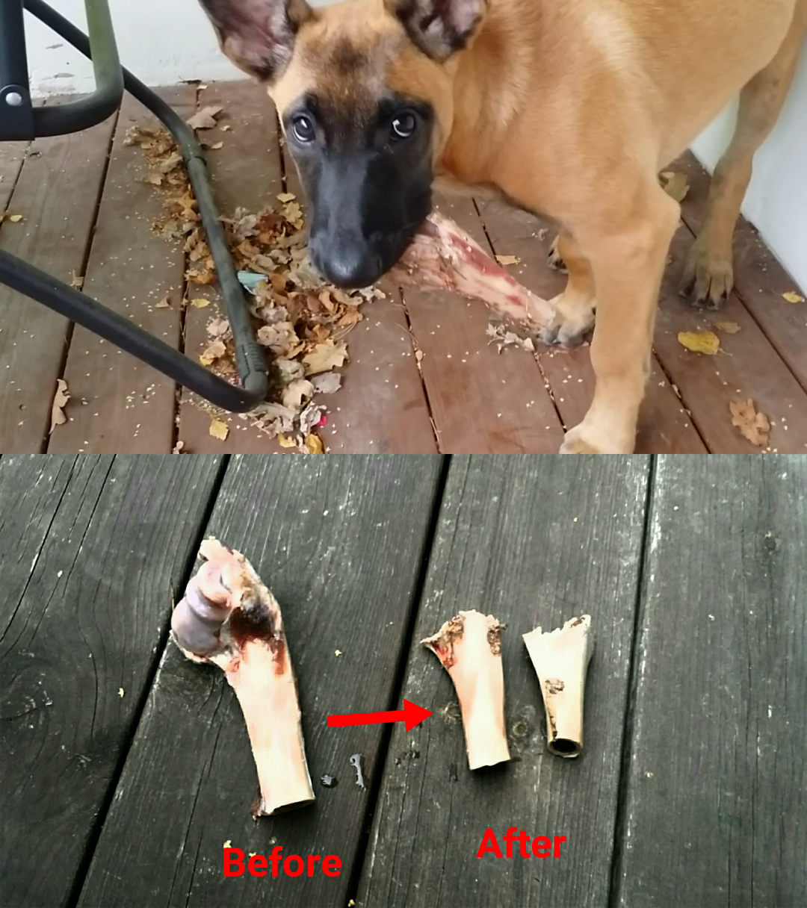
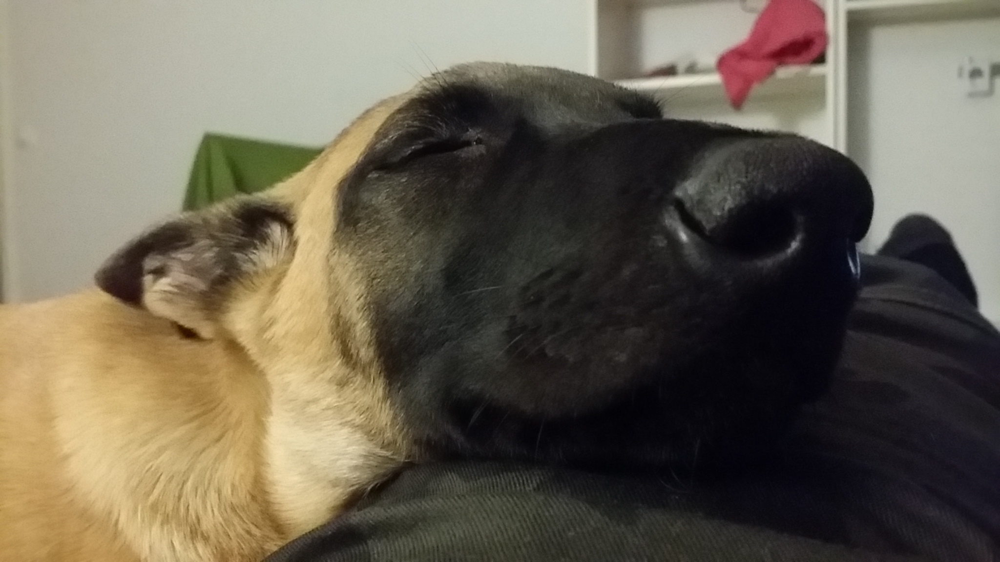

# Week 15 (14 week old belgian malinois puppy)

This weeks focus is on jump training (not jumping up when greeting) and sitting without taking pows off the ground to grab something. I don't really have a name for these exercises but I really like both of them because they teach the dog to stay on the ground even when excited. 

Also this week I'm focusing on distractions which are irritating to the dog. Examples include: large outdoors brush, vacuum cleaner, baloons (because they pop). Anything we can find. These things need to be associated with something positive such as treats or praise. 

# Deer bones as a tooth brush
After each meal Alice likes to chew on her deer bones. Specially now at 14 weeks the puppy teeth are starting to fall out. Two top ones have already given way and one of the canines (the one she broke during playing tug at 11 weeks - happy it has finally fallen out without any infections). This period is made easier by the raw bones she gets to exercise her teeth with. 

# Training to sit without jumping for food
This exercise involves taking a treat and slowly moving it downwards towards the nose of the dog when the dog is sitting in front of you. If the dog tries to jump and grab the treat you lift it up and then move it down again when the dog sits back down. The dog is only supposed to be rewarded when it sits with all paws on the ground. 

# Training to not jump when greeting
This exercise involves standing up straight, calling dog towards you while keeping one hand on your chest. The dog sees the hand and will naturally try to jump on you. You then wait until dog sits down in front of you and then reward the dog with the other hand such that it learns that hand up towards chest does not have treats. This is usually what people would do when a dog comes up against them so teaching it like this is a good way to teach the dog not to jump up on people. Also if there are other behaviors that people do (besides patting the dog) when it comes towards it, train the same exercise while emulating such behaviors as well. Rewards are given with the other hand by lowballing them to the dog so that the dog is not enticed to jump to get the treat. 

# Using tug to teach obedience
These dogs love to play tug. I use a towel for the most part. Toys will work too but a towel or just a rag is softer and less likely to break a tooth at this stage. The purpose of the tug game is first and foremost to teach the dog how to control pray drive and to only engage in it on command. This is the primary aim with tug play but tug can be used as a reward for doing all obedience exercises as well. 

* Wait: intice the dog with the tug - she should remain focused either on the tug or on you or be switching between eye contact and looking at the tug. This is the behavior that is expected when told to wait. The dog should then jump at the tug when told the release command - for example "go". 
* No: a different object playes the role of the tug (a soft doll or childrens toy - something that is never used for playing the game otherwise). The dog should never attach the soft toy when told no.
* Sit: the dog is told to sit. Then as soon as the sit is completed the tug wakes up to life and the dog is rewarded with it. 
* Down: the dog is told to down. As soon as a complete down is finished, the tug appears and the dog is rewarded with a game. 
* Watch: the dog is told the command for making eye contact with you. The moment eye contact is made the dog is rewarded. Gradually the length of the required eye contact is increased so that the dog stares at you for longer periods to get the tug. 
* Heel: the tug is held higher up in front while walking and the dog should be making eye contact while walking beside. Then tug is used as reward for walking a certain distance. 

The aim in the game of tug is to emulate behavior of pray that the dog would normally chase. Taking the tug away from the dog at any moment is considered as punishment. When I first started playing tug with different dogs I was doing the game wrong. I was mistakenly only assuming that the bite itself was the reward. In reality, the biggest reward for the dog is when the tug stops struggling - that's when the chase is completed. The dog will even instinctively let go of the tug when it stops moving (and unless told to wait, will also grab it again whenever it starts moving). 

Therefore the game starts with a lot of energy and then gradually the tug makes fewer and fewer jerks until it finally stops moving. The dog is then told to "out" and should let go of the tug. For the promt let go of the tug the dog is rewarded with another game. Upon the completion of the last game the dog is allowed to simply have the tug and will quickly lose interest in it once it has stopped moving.

# Using confinement to teach emotional self control
I'm generally against using confinement when it is used because the owner is simply lazy - such as for example locking the dog up as a way to avoid training it to behave properly around the house and around other people. The use of confinement is very psychological and should only be used with a clear goal in mind. Things that can be trained in confinement is for example the anxiety that the dog feels when she can see her owner but can not come close. Another good use for confinement is when the dog is eating a fresh meaty bone which has not been chewed free of bloody meat yet - which is undesirable to have on the sofa or anywhere else when it is highly likely to leave blood stains all over the place. Confinement serves then as the place where to chew on such bones until they become dry enogh to be taken other places (if at all). 

The way I train emotional control this week by using confinement is by putting the dog in the confinement - at this stage she feels pretty used to confiment in the car so she lays down, chews on her bones and perhaps sleeps. If the dog is in drive when put in the confinement she will not just chill out right away. At that point she will bark and show her teeth to let one know how unhappy she is to be there. This is when confinement works even better.

* Determine ahead of time how long the confinement will last (30min is usually plenty). 
* When the door is closed and she still barks just sit beside her and stay calm.
* If she continues barking then stand up and walk away. 
* If she is calm then just go about doing something else and leave her there until the timer rings. 
* When you walk away, two things can happen: she stops barking right away or she continues to bark excessively for a while after you are out of view and then stops. Just stand somewhere where she can not see you and listen. 
* When she stops barking, show yourself. If barking restarts, walk away again. 
* If she sits there looking at you then slowly walk towards her. 
* If she starts barking, turn quickly around and start walking away (slowly is good here because if she stops barking you want to have opportunity to turn around and start walking towards her again. 
* If she does not bark then sit close to the cage and pet her, give her treats etc. 
* Then sit still as before. If she starts barking then walk away. 
* Repeat. 

This is a highly psychological game where the dog only gets your presence and other rewards if she can control her drive and stay calm.

* When time is up, do the same routine to illicit calmness and once you are close to the cage door start unlocking the cage slowly.
* If barking starts, lock the door and walk away and repeat. 
* The wait command can be used to keep the dog in position and calm at this point. (I only use wait when there is a clear reward coming. Such as getting out of the cage). 
* Open the cage door slowly to wide open. The dog should lay in the cage. 
* Look at me command can be used to keep the dog watching you and not the cage door (thinking about how to take a shortcut and rush out). 
* As the door has opened, move away from the cage a little (this is to create some distance and further practice wait and look at me). 
* Then do a recall. She rushes towards me with tail wagging and finally gets the ultimate reward (being close). 
* If the dog sleeps by the time the confinement time is up, open the door anyway to let her know there is a choice - either remain in the crate or leave. She will most likely continue to sleep in there with the door open. 

The exercise is completed. 

This is how I prefer to use confiment - as a tool to practice skills that are hard to practice without it.

# Continued training of wait, stay and attention (look me in the eyes)
This week we have been consistently getting better at stay and wait. I can now walk away at least 5m and Alice does not move towards me but waits for her treat while looking at me. I have achieved this mainly through extending the time between giving her treats and I have also started using popping sound with my mouth very consistently whenever she does something right. This is the same as using clicked but who has a clicker with them everywhere they go?? WHy use clicker when you have a mouth with a tongue inside it? So this has really helped accelerating the progress. 

Also I have now been consistently getting her to wait with taking food until getting a command. I have tested the fact that she actually understands the words by saying random words with the same intonation and she was able to resist taking the chicken until given the comand to go for it. At which point she eagerly ate the chicken placed right in front of her. 

# Potty training
The potty training has been going very well now. She is now going only once per night (between 23:30 and 1:30) and then sleeps through the night until around 6-7 oclock the next morning - at which point I take her out and she can pee 2-3 times. This is good - she understands that she has to hold it in. During the day the amount of time is still max 3-4 hours. She barks and runs around when she has to go so this is very clear and easy to see. She is able to adjust how much she drinks and eats in the evening to avoid going potting. Very good.

